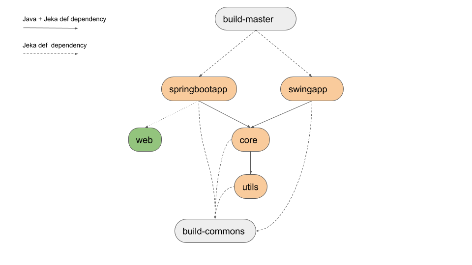

# Springboot multi module example

## Purpose
This project showcases how to organise a multi-module project with Jeka and especially a project integrating Springboot 
with pure client web application. It also demonstrates how to share common build features amongs multiple modules and how to 
drive the whole build.

__Note__ : This is not the only way to organize multi-module projects :
* It's possible to have a "master" module at the same level than the other modules.
* It's not necessary to have a 'build-common' module. It's possible to define the common builds into  module 'utils' for example.

## What is inside ?

This project contains two applications providing the same functionality : compute a magic formula according an input number.
One application is a standalone Swing application while the other is web2 application powered by Springboot.

The formula computation is provided by _core_ modules that in turns depends on  _utils_ as described below.

 

* __core__ : Library that actually compute the "magic formula". It uses in turn the __utils__ lib to accomplish some parts of the computing.

* __swingapp__ : Standalone swing application exposing _magic formula_. Jeka produces a fat jar containing all needed dependencies.

* __springbootapp__ : Springboot application exposing _magic formula_. Jeka triggers client part ([web](./web)) build to include it in _springbootapp.jar_ 

* __web__ : Web graphical interface embedded in _springbootapp_. This is a pure web project, built with _node.js/npm/webpack_ without any trace of Jeka.

* __build-master__ : Contains only Jeka commands to trigger overall build.

* __build-common__ : Contains common build code used by all other modules. Note that this could have also been included in the _utils_ module, which is the most downstream module, instead of inside a specific one. 


## How to build

**Note :** _Node.js + npm_ must be installed on the hosting machine in order to build [web](./web) module.

### Build all

From _springboot-multi-modules_ :

```shell
./jekaw build
```

### Build springbootapp only

Go to  *springboot-multi-modules.springbootapp* directory and execute :

```shell
./jekaw cleanPack
```

To run the built instance : 
```shell
./jekaw run
```

### Build swingapp only

Go to  *springboot-multi-modules.swingapp* directory and execute :

```shell
./jekaw cleanPack
```
To run the built instance : 
```shell
./jekaw run
```
